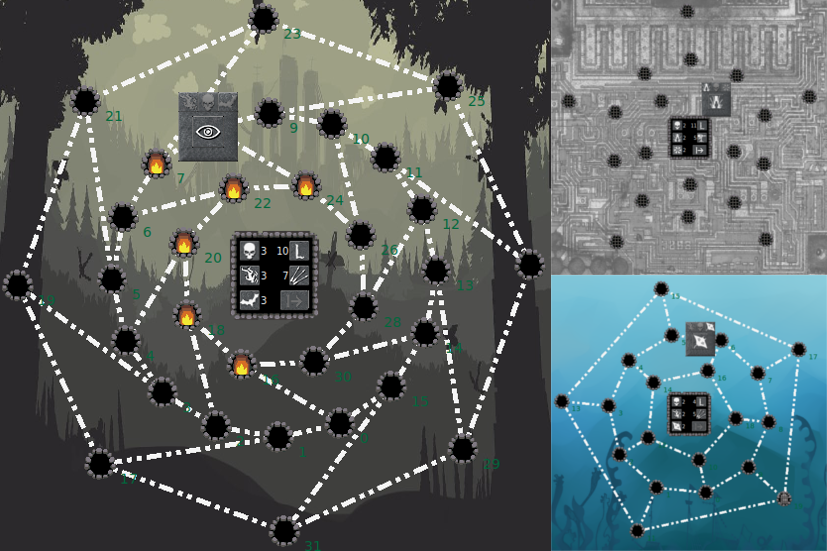

# Game "Hunt the wumpus"

## Game rules:

1. You are the Hunter starts in the dark cave with rooms. Somewhere here lives one or more Wumpuses - terrible monster.
2. Your main goal is to kill all Wumpuses and return to home through the caves, underwater, dead city and some other places.
3. On the way you will be trapper in danger of two types:
  - things which move you from one room to another room (for example, The Bats);
  - things that kill you (for example, The Bottomless pits "
4. You have only the bow, the limited count of arrows on each level and the device that detects monsters and traps
5. Meeting of the Wumpus and the Hunter means dead of the Hunter.
6. Meeting with The Bats or similar things is means that you moved from meeting room to another one randomly.
7. Meeting with the trap like The Bottomless Pit means dead of the Hunter.
8. To leave the level, you should kill all Wumpuses, find the door and open it. At the first level the door is unhidden.

## Controls are:

```
LMB - move to room\n"
RMB - shot into the room\n"
MMB - mark/unmark the room\n";
```
## Dependicies:

Game has following dependicies:
* game's gui based on `FLTK` library
* game's audio output is provided by `audio_out` library (wrapper to Bass library)

## Installation under the Windows

### 1. Download `wumpus_game` sources

* download game archive and unpack it to, i.e., `c:/wump/`
* create folder `bin` in `c:/wump/` if not presents, or remove `*.exe* files

### 2. Install dependicy gui library `FLTK`

Standart installation of game is provided by `cmake`. Thus to install game using `cmake` we should install `FLTK` library by `cmake` too (since only by this install type we would have all necessary files for `cmake`).

* download latest `FLTK` release from [fltk`s site](http://www.fltk.org/software.php)
* unpack to folder, i.e. `c:/fltk_1.3.4/sources/`
* open `fltk` folder in MSVC by `File -> Open -> Folder`, then starts auto cache generation
* choose `x86-Release` on the `Panel`
* then `CMake -> Build All`
* after building was ended - copy `build` dir to `c:/fltk_1.3.4/` (from dir usually `~/CMakeBuilds/{some_hash}/x86-build/)
* then `CMake -> Install -> FLTK`
* after installing was ended - copy `install` dir to `c:/fltk_1.3.4/` (from dir usually `~/CMakeBuilds/{some_hash}/x86-install/)

### 3. Install `BASS` audio library

* download archive from [official bass library site](http://www.un4seen.com/download.php?bass24)
* unpack `mp3-free/bass.dll` to the `bin` directory of the game build folder (i.e. `c:/wump/bin/`)
* unpack `c/bass.lib` to the current build folder (usually `~/CMakeBuilds/{some_hash}/x86-build/`)

### 4. Install `wumpus_game`

* in MSVC, open `c:/wump/` by `File -> Open -> Folder`

Build starts automatically, but will stop with errors about absent some FLTK`s cmake files:

* choose `x86-Release` on the `Panel`
* go to `CMake -> Change CMake Settings -> CMakeLists.txt`
* add to `cmakeCommandArgs` path to FLTK build, i.e. "cmakeCommandArgs": "-DFLTK_DIR:PATH=\"c:/fltk_1.3.4/build/\""
* build all with `CMake -> Build All`
* copy `wump_game.exe`, `wump_test.exe` and `c:/wump/source/src/resources/` to `c:/wump/install`

### 5. Running binary instead of building from sources

You need to download and install Microsoft Visual C++ 2015 Redistributable Package to be able to run game.

## Installation under the Linux

### Prepare game directory:

```
  $ cd ~/
  $ git clone https://github.com/ans-hub/wumpus_game.git
  $ cd wumpus_game
  $ mkdir build
  $ mkdir bin
```

### Install FLTK:

Standart installation of game is provided by `cmake`. Thus to install game using `cmake` we should install `FLTK` library first by `cmake` too (since only by this install type we would have all necessary files for `cmake`).

```
  $ mkdir ~/libs/fltk
  $ cd ~/libs/fltk/
  $ svn co http://seriss.com/public/fltk/fltk/branches/branch-1.3/ fltk-1.3
  $ mkdir build
  $ cd build
  $ cmake ../
  $ make
```

### Install BASS:

```bash
  $ wget http://us.un4seen.com/files/bass24-linux.zip
  $ unzip bass24-linux.zip -d tmp/
  $ sudo cp tmp/mp3free/libbass.so /usr/local/lib/
  $ sudo chmod a+rx /usr/local/lib/libbass.so
  $ sudo ldconfig
  $ rm -rf tmp/ bass24-linux.zip
```

### Build game

```
  $ cd ~/wumpus_game/build
  $ cmake ../ -DFLTK_DIR:PATH="~/libs/fltk/build"
  $ cp wump_* ../bin
  $ cp -r ../src/resoures/ ../bin/
```

## Notes:

1. ["Hunt the wumpus"](https://en.wikipedia.org/wiki/Hunt_the_Wumpus), invented by [Gregory Yob](https://en.wikipedia.org/wiki/Gregory_Yob) in 1972 or 1973. 
2. Original game has 20-rooms labirint since its based on plane projection of [regular dodecahedron](https://en.wikipedia.org/wiki/Regular_dodecahedron) using Schlegel diagram. In my implementation this is more than 20 rooms in depends of game level.

## Gameplay video on youtube:

<p align="center" width="60%"><a href="https://youtu.be/8MtrtkYhbKU"></a></p>
